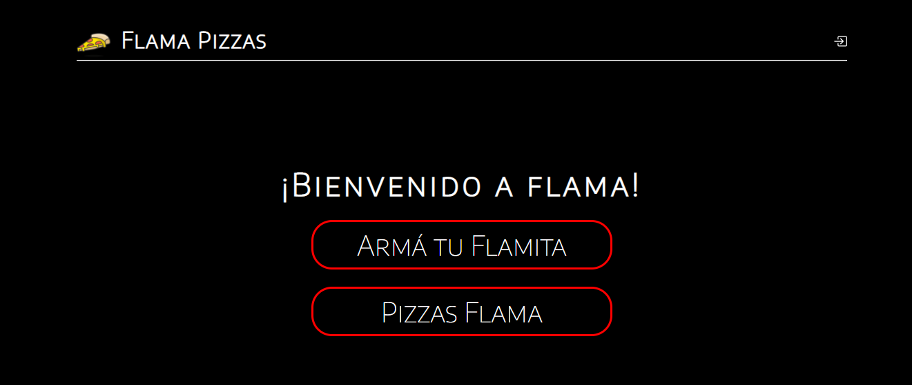
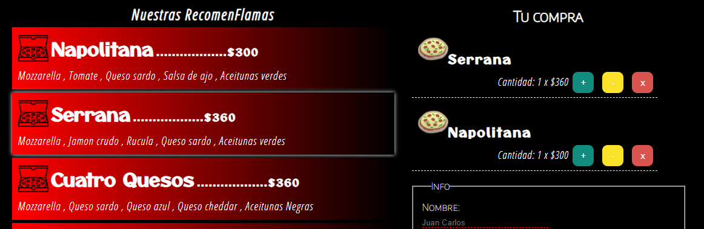
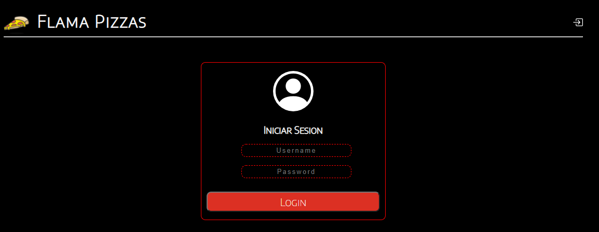
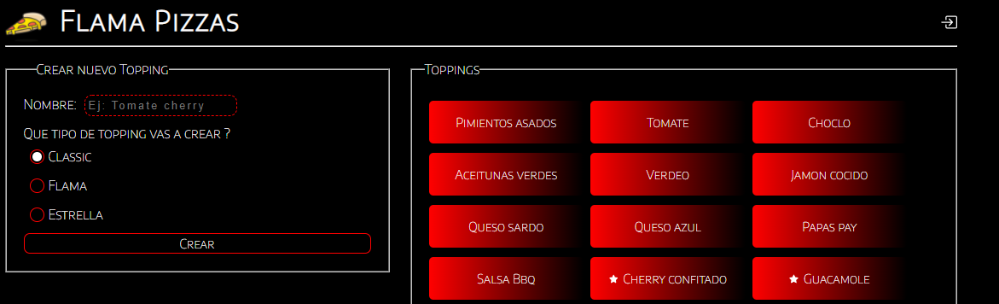

## Flama Custom Pizza :pizza:

"Flama Custom Pizzas", es un local destinado a la venta de pizzas personalizadas (armadas por los clientes), como también predeterminadas, es decir armadas por el local. Anteriormente la forma en la que los clientes armaban su pizza personalizada , era a través de un pequeño formulario de papel, es así, como nace la app de Flama-Pizzas, la cual tiene como objetivo, brindarle al cliente una interfaz digital, en donde el mismo pueda armar su pizza de una manera mas cómoda y agradable a la vista. 
La app, no solamente tiene como finalidad ser una interfaz digital, si no también, generar un ticket 'comanda' en donde se detalle el pedido. Cuenta con una sección privada, a la cual se accede mediante un usuario y contraseña, en donde los propietarios pueden, crear o borrar, nuevas pizzas, toppings, etc.

1- Ejecutar "**npm install**" para reconstruir los módulos de node.

2- Ejecutar **npm start** para iniciar en modo desarrollo

3- Para ver el dashboard privado ingresá con el siguiente nombre de usuario y password:

    username: admin
    password: admin123

Previews

